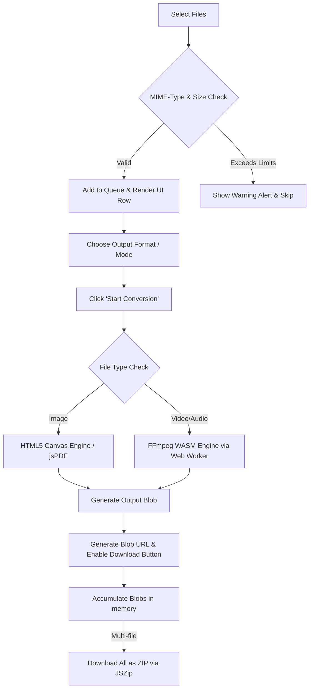

# Universal Batch Converter (Serverless & Private)

A professional-grade, high-performance, and privacy-focused file converter that runs **100% in the user's web browser**. It processes Images, Videos, Audio, and PDF files client-side using WebAssembly (Wasm) and HTML5 APIs. Since no files are uploaded to a remote server, it offers absolute privacy, zero bandwidth waste, and works offline.

---

## 🚀 Key Features
*   **Zero Server Uploads:** All conversions are processed locally on the user's CPU/GPU.
*   **No File Limits:** Convert unlimited images without paywalls or daily restrictions.
*   **Offline Mode:** Fully functional without an active internet connection after the initial page load.
*   **WebAssembly Powered:** High-performance media encoding/decoding via FFmpeg compiled to WASM.
*   **Clean & Modern UI:** Fully responsive interface featuring sleek transitions, a responsive grid, and dark mode.

---

## 🧠 Working Principle (How the Code Works)

The app leverages modern web capabilities to bypass traditional server-side processing. The step-by-step processing lifecycle is detailed below:



### 1. File Selection & Validation
*   When a user selects files using the file input (`#file-input`), the app processes the `FileList` object.
*   It checks the file categories (Images, Audio/Video, PDFs) and enforces size boundaries (`MAX_VIDEO_SIZE = 75MB`) and counts (`MAX_VIDEO_COUNT = 20`, `MAX_PDF_COUNT = 15`) to protect browser memory.

### 2. Interface Generation & Context Population
*   A queue list containing item cards is created dynamically in the DOM (`#queue-area`).
*   The options dropdown (`#format-select`) is populated using `populateOptions()` which scans the MIME-type of the first item in the queue and exposes only valid conversion targets (e.g., converting a video to audio or animated GIF, or an image to WebP/JPEG/PNG/PDF).

### 3. Conversion Core Execution
When the user clicks "Start Conversion":
*   **Images:** Handled by `convertImage()`. It generates an in-memory bitmap of the image via `createImageBitmap()` and draws it onto a hidden HTML5 `<canvas>`. It then calls the browser's native `canvas.toBlob()` to re-export the image into `image/jpeg`, `image/png`, or `image/webp` format at a high quality factor (0.9).
*   **PDF Merging:** Handled by `mergeAllToPDF()`. It converts uploaded images to Base64 URLs and embeds them page-by-page into a `jsPDF` document instance before triggering a save.
*   **Video & Audio:** Handled by `convertMedia()`. Because video conversion is resource-intensive and can block the browser UI thread, it is delegated to a separate thread called a **Web Worker** (`ffmpeg-worker.js`). FFmpeg.wasm writes the raw file bytes to its virtual MEMFS filesystem, executes standard FFmpeg CLI commands (e.g. `ffmpeg -i input -preset ultrafast output.mp4`), and reads the completed output array back into a Javascript `Blob`.

### 4. Downloading the Outputs
*   Individual download links are built using standard object URLs (`URL.createObjectURL(blob)`).
*   For bulk operations, `JSZip` compresses the array of converted `Blob` outputs into a single zip archive on-the-fly (`converted_batch_with_[hostname].zip`), keeping everything strictly in-memory.

---

## 📂 Directory Structure & Code Map

### 1. Front-End Core: [`index.html`](file:///d:/converter%203.0/index.html)
The core application is monolithic for fast loading. It is structured into three main blocks:
*   **CSS Styles & Design Tokens (Lines 38–213):**
    *   Defines core color variables (`--primary`, `--success`, `--bg`, `--surface`) inside `:root` and `[data-theme="dark"]` to support Light/Dark modes.
    *   Configures core transitions, responsive containers, upload zone styling, active button state overrides, and fade/slide keyframe animations.
*   **HTML Structure (Lines 219–315):**
    *   Defines layouts for the application title, upload drop-zone, conversion controls, queue table, comparisons/SEO marketing table, and footer.
*   **JavaScript Logic Engine (Lines 317–648):**
    *   *Theme Switcher (Lines 321–345):* Toggles the `data-theme` body attribute and updates LocalStorage.
    *   *State Variables (Lines 348–357):* Tracks file `queue`, `completedBlobs`, loaded `ffmpeg` client, and worker execution states.
    *   *Event Handlers (Lines 359–410):* Listens for file input updates, validates file metadata, resets DOM structures, and switches display cards.
    *   *Dropdown Population (Lines 426–451 - `populateOptions`):* Detects MIME category and fills formats.
    *   *Batch Loop Controller (Lines 479–536):* Manages progress states and iterates through the queue calling conversion engines.
    *   *Image Canvas Engine (Lines 552–569 - `convertImage`):* Controls canvas rendering and blob exports.
    *   *FFmpeg Worker Interface (Lines 571–621 - `convertMedia`):* Downloads WASM engines, binds progress listeners, mounts files into MEMFS, and runs transcoding scripts.
    *   *jsPDF Merging Engine (Lines 623–639 - `mergeAllToPDF`):* Integrates multiple images into a single PDF.

### 2. Background Thread: [`ffmpeg-worker.js`](file:///d:/converter%203.0/ffmpeg-worker.js)
A vanilla, classic Web Worker script.
*   Loads the `@ffmpeg/core` JavaScript files.
*   Intercepts message events (`LOAD`, `EXEC`, `WRITE_FILE`, `READ_FILE`, `DELETE_FILE`).
*   Manipulates the Emscripten filesystem (`ffmpeg.FS`) and invokes the core execution function (`ffmpeg.exec`) inside the Web Worker thread to prevent freezing the user's web page.

### 3. Server Header Overrides: [`_headers`](file:///d:/converter%203.0/_headers)
*   Contains configurations for hosting providers. Notes that COOP/COEP headers are disabled, enabling the app to run on basic hostings (e.g. Netlify/Vercel) without blocking third-party CDN libraries.

### 4. Auxiliary Pages:
*   [`contact.html`](file:///d:/converter%203.0/contact.html) & [`feedback.html`](file:///d:/converter%203.0/feedback.html): Support page forms using direct `mailto:` templates.
*   [`terms.html`](file:///d:/converter%203.0/terms.html): Zero-knowledge security policy.

---

## 🎨 Theme & Color Customization Guide

All styles are configured using CSS Variables (Custom Properties) defined at the top of [`index.html`](file:///d:/converter%203.0/index.html).

### Changing Button Colors
*   **Primary Action Buttons** (e.g., *Start Conversion*, *Convert Separately* / *Merge* toggles):
    *   Controlled by `--primary`. By default, it is **blue** (`#0070f3` in light mode, `#3291ff` in dark mode).
*   **Green Buttons & Badges** (e.g., *Download* buttons, *Done* statuses):
    *   Controlled by `--success`. By default, it is **green** (`#28a745` in light mode, `#49aa19` in dark mode).

### Color Variable Locations:
To change the green buttons to another color (for example, a modern violet or dark gray), edit the hex values inside [`index.html`](file:///d:/converter%203.0/index.html):

#### Light Mode Definition (Lines 40–53)
```css
:root {
    --primary: #0070f3;       /* Blue - Main Button Background & Accents */
    --error: #e00;            /* Red - Fail Status and Badges */
    --success: #28a745;       /* Green - Change this to customize the 'Download' button color */
    --bg: #fafafa;            /* Off-White - General Background */
    --surface: #ffffff;       /* Pure White - Main Card Box */
    --text: #333333;          /* Dark Gray - Text */
    --sub-text: #666666;      /* Medium Gray - Subtitle / Small Text */
    --border: #eaeaea;        /* Light Gray - Outline Borders */
}
```

#### Dark Mode Definition (Lines 55–68)
```css
[data-theme="dark"] {
    --primary: #3291ff;       /* Light Blue - Active state color */
    --error: #ff4d4f;         /* Bright Red - Errors */
    --success: #49aa19;       /* Lime Green - Change this to customize dark mode 'Download' buttons */
    --bg: #111111;            /* Pitch Black - Dark Mode Background */
    --surface: #1a1a1a;       /* Dark Charcoal - Cards Background */
}
```

*Simply replace these hex codes, and the entire site's theme, borders, and buttons will adapt instantly!*

### Unified Dark Mode Persistence
The application uses the `theme` key in `localStorage` to synchronize dark/light modes across all pages. 
* Toggling the theme via the button on the homepage (`index.html`) writes `theme: "dark"` or `theme: "light"` to the browser's storage.
* The auxiliary pages (`contact.html`, `feedback.html`, `terms.html`) run an inline script block inside `<body>` to check and apply this setting immediately on load:
  ```html
  <script>
      if (localStorage.getItem('theme') === 'dark') {
          document.body.setAttribute('data-theme', 'dark');
      }
  </script>
  ```

---

## ⚙️ How to Add New File Formats

To expand the application's supported file types, follow these instructions depending on the type of media you want to add.

### 1. Adding Video & Audio Formats (e.g., `.avi`, `.mov`, `.flac`, `.ogg`)

Since FFmpeg is used as the backing engine, it natively supports almost all formats. You only need to register the format in the UI and map its output MIME-type.

#### Step A: Enable Selection in the File Input
Open [`index.html`](file:///d:/converter%203.0/index.html) and go to **Line 236**. Add your new extension if it isn't captured by standard wildcards, e.g., adding `.flac` or `.mov`:
```html
<input type="file" id="file-input" multiple accept="image/*,video/*,audio/*,.pdf,.mov,.flac">
```

#### Step B: Add Option to the Options Dropdown
Go to `populateOptions` (around **Line 426**). Add your format value and friendly label to the respective category:
```javascript
if (mimeType.startsWith('video/')) {
    add('mp4', 'MP4 Video');
    add('avi', 'AVI Video');             // <-- Added AVI
    add('mov', 'MOV QuickTime');         // <-- Added MOV
    add('mp3', 'Extract Audio (MP3)');
    add('gif', 'Animated GIF');
} else if (mimeType.startsWith('audio/')) {
    add('mp3', 'MP3 Audio');
    add('wav', 'WAV Audio');
    add('flac', 'FLAC Lossless Audio');  // <-- Added FLAC
    add('m4a', 'M4A Audio');
}
```

#### Step C: Map Output MIME-type
Go to `convertMedia` (around **Line 571**). Scroll down to the MIME-type mapping logic (around **Line 610**) and register the MIME-type associated with your new extension so that the browser downloads it with correct headers:
```javascript
let mimeType;
if (format === 'mp3') {
    mimeType = 'audio/mp3';
} else if (format === 'm4a') {
    mimeType = 'audio/x-m4a';
} else if (format === 'flac') {
    mimeType = 'audio/flac';             // <-- Added MIME-type for flac
} else if (format === 'avi') {
    mimeType = 'video/x-msvideo';        // <-- Added MIME-type for avi
} else if (format === 'mov') {
    mimeType = 'video/quicktime';        // <-- Added MIME-type for mov
} else if (format === 'gif') {
    mimeType = 'image/gif';
} else {
    mimeType = `video/${format}`;        // Fallback fallback
}
```

---

### 2. Adding Image Formats (e.g., `.bmp`, `.tiff`)

Images are processed using the browser's HTML5 Canvas API.

#### Step A: Register the Option in the UI
In `populateOptions` (around **Line 434**), add the target format to the image condition:
```javascript
if (mimeType.startsWith('image/')) {
    add('png', 'PNG Image');
    add('jpeg', 'JPEG Image');
    add('webp', 'WebP Image');
    add('bmp', 'BMP Image');             // <-- Added BMP
    add('pdf', 'PDF Document (Individual)');
}
```

#### Step B: Verify Canvas Support
Inside `convertImage` (around **Line 552**), the canvas draws the bitmap and calls:
```javascript
return await new Promise(r => canvas.toBlob(r, `image/${format}`, 0.9));
```
*Note:* Modern browsers natively support canvas conversions to `'image/png'`, `'image/jpeg'`, `'image/webp'`, and sometimes `'image/bmp'`. If you need to convert to more exotic formats (such as TIFF or EPS), the canvas API may fail. In that case, you should route image conversions through the WebAssembly FFmpeg engine inside the `convertMedia` branch instead.

---

### 3. Adjusting Limits & Constraints
If you need to change limits (e.g. increase the maximum file size or total files allowed), open [`index.html`](file:///d:/converter%203.0/index.html) and edit these variables around **Lines 348–350**:
```javascript
const MAX_VIDEO_SIZE = 100 * 1024 * 1024; // Change video limit to 100MB (currently 75MB)
const MAX_VIDEO_COUNT = 30;               // Allow up to 30 media files
const MAX_PDF_COUNT = 25;                 // Allow up to 25 PDFs
```

---

### 4. Updating Contact Emails
To change the default support email address (`ug2898@gmail.com`), search and replace the string in the following files:
*   [`contact.html`](file:///d:/converter%203.0/contact.html) (approx Line 19 and 20)
*   [`feedback.html`](file:///d:/converter%203.0/feedback.html) (approx Line 17 and 18)


https://share.google/aimode/rIzm4rlWnueGKm78o

https://freebatchconvert.netlify.app/